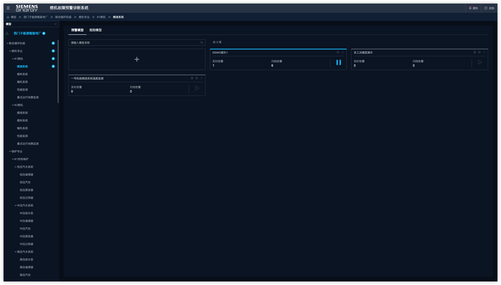
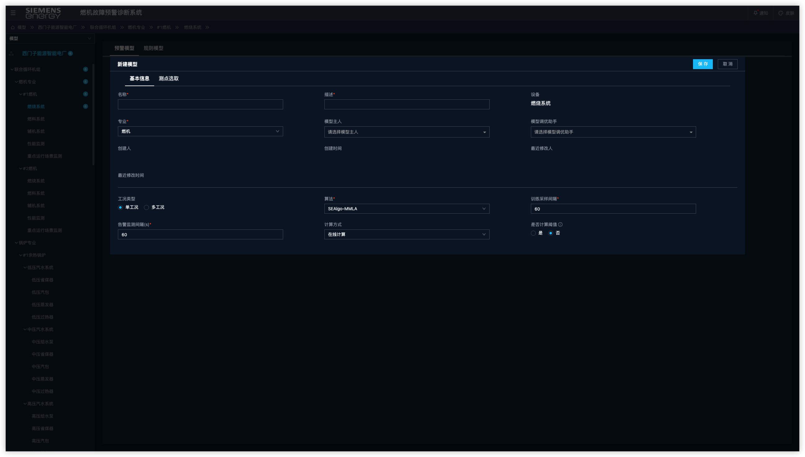
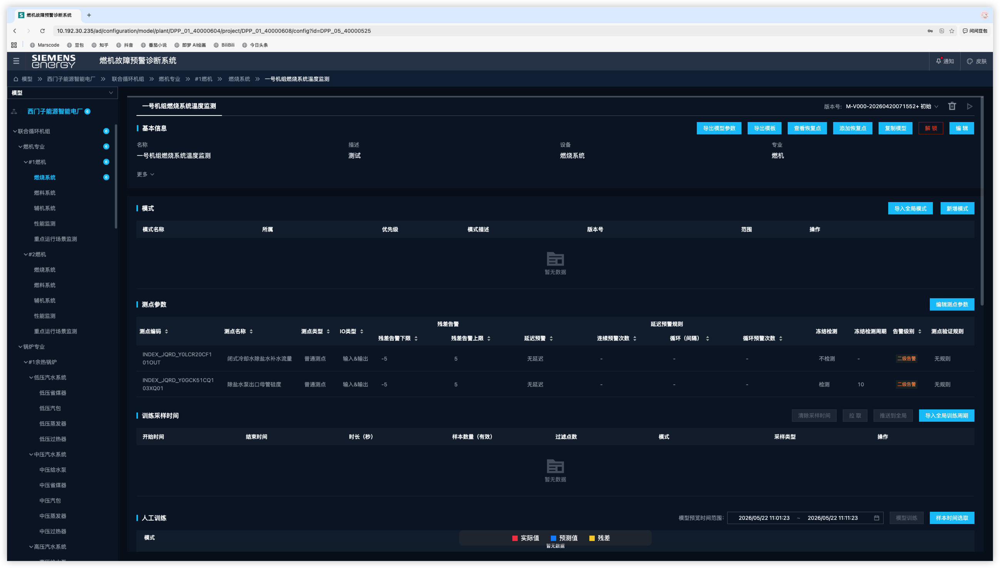

# 如何创建一个 AI 监测预警模型(基本信息)

> **模块**:模型配置 · **角色**:工程师 · **配套视频**:V1 · 00:00 起

本篇讲清楚“新建模型”第一步——**基本信息页签**怎么填。后续的测点选取、模式配置、训练等步骤,见 #3 ~ #7。

---

## 一、什么时候用它

当你需要让系统**自动学习一组测点的正常运行规律,并在偏离时报警**,就要创建一个 AI 监测预警模型。如果只是“超过某个数值就报警”这种确定性判断,用规则更合适(见 #8)。

## 二、入口

登录系统 → **建模平台 > 配置中心** → 在左侧目录树选中目标设备(电厂 / 机组 / 系统 / 设备) → 进入“模型”页面 → 点击**「创建新模型」**。

## 三、基本信息页签:字段说明

进入新建页面后,默认停在「基本信息」页签。页面字段分两类:**带星号的为必填项**,无星号的为可选项或系统自动带出的只读信息。

### 必填字段

**1. 名称 \***

该设备下唯一,不能与已有模型重名。建议命名能体现监测对象,例如“一号机组燃烧系统温度监测”。

**2. 描述 \***

简要说明本模型用于监测什么设备的什么异常,方便后续运维同事查找和理解。

**3. 专业 \***

模型所属的专业方向,从下拉框中选择,例如“燃机”“汽机”“电气”等。该字段决定了模型在专业维度下的归类。

**4. 工况类型 \***

- **单工况**:设备长期处于单一稳定运行状态,只需配一个默认模式 → 见 #4
- **多工况**:设备有明显的运行状态切换(如启停、负荷段切换),需为每种状态分别配置模式 → 见 #7

**5. 算法 \***

下拉选择,3 选 1:
- **SEAlgo-MMLA**
- **SEAlgo-NRDA**
- **SEAlgo-PBA**

三种算法的选择标准见 #2《三种算法对比》。新建模型默认填充 `SEAlgo-MMLA`。

**6. 计算方式 \***

- **在线计算**:流式实时计算,启用后会出现在「模型监测」页签。生产监测场景默认选这个。
- **离线计算**:批处理模式,启用后**不会**出现在「模型监测」页签,需到「批量数据处理」中手动计算。用于历史数据回算或验证。

> ⚠️ **重要**:模型一旦上线,计算方式不可修改。新建时务必想清楚。

**7. 训练采样间隔 \***

对测点数据做对齐 / 同步采样时使用的时间间隔(秒),默认值 **60**。该值决定了一个采样周期内有多少个数据点——间隔越小、点越密、模型越细,但训练计算量也越大。

**8. 告警监测间隔(s) \***

模型在线运行时,系统每隔多少秒做一次预测和告警判断,默认值 **60**。一般与训练采样间隔匹配或略大。

### 可选字段

**9. 模型主人**

从下拉框中选择该模型的责任工程师,用于后续告警归属、运维责任划分。可在创建后再指定。

**10. 模型调优助手**

辅助调优该模型的工程师,从下拉框选择。常用于将模型移交给同事协同优化时使用。

**11. 是否计算阈值**

- **是**:训练时系统**自动**为每个测点调节残差告警阈值(推荐新手使用)。
- **否**:需要在测点参数页手动指定上下限(进阶,见 #5)。

新建模型默认为 **否**,建议根据实际场景按需切换。

**12. 版本描述**

对当前版本的简要说明(如“首次创建”“调整测点后重训”),方便后续版本追溯。

### 系统自动带出的只读字段

下列字段无需手动填写,创建和编辑过程中系统会自动记录并展示:

- **设备**:进入新建页面前选定的目标设备,例如“燃烧系统”
- **创建人 / 创建时间**:首次保存模型时记录
- **最近修改人 / 最近修改时间**:每次保存编辑后更新

## 四、保存进入下一步

填好基本信息后,**不要点保存**——先切到「测点选取」页签为模型挑测点(见 #3《如何为模型选取测点》)。两个页签都填完,点击页面底部的「保存」,才会进入「模型配置」编辑页面,系统自动分配版本号并锁定给创建者。

## 五、常见疑问

**Q1:基本信息填错了,启用后还能改吗?**

能。在「模型配置」页面顶部点「编辑」即可修改。但**计算方式(在线 / 离线)在模型上线后不可改**;**工况类型**一旦确定后,切换会影响已配置的模式,需谨慎调整。

**Q2:模型创建后为什么是锁定的?**

新模型自动被创建者锁定,只有创建者能编辑。如需移交,点击右上角「解锁」即可释放编辑权限。

**Q3:训练采样间隔和告警监测间隔有什么区别?**

前者是“训练阶段”用的,后者是“在线运行”用的。训练间隔决定模型学得多细,告警间隔决定上线后多久判断一次。

**Q4:专业、模型主人这些字段后期可以修改吗?**

可以。在「模型配置」页面进入编辑模式即可调整,修改后系统会更新“最近修改人 / 时间”。

---

📌 **下一步**:#3 如何为模型选取测点 → #4 如何配置工况模式 → #5 如何配置测点参数 → #6 如何选取训练样本并训练模型